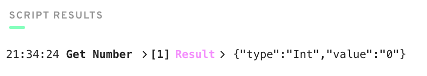
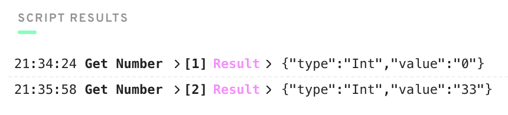

# Transactions and Scripts
## Chapter 2, Day 2

[Lesson](https://github.com/emerald-dao/beginner-cadence-course/tree/main/chapter2.0/day2)

### Quest

#### 1. Explain why we wouldn't call changeGreeting in a script.
Scripts can only read contract data. Changes can only be performed in a transaction.

#### 2. What does the AuthAccount mean in the prepare phase of the transaction?
AuthAccount is the wallet that signed and submitted the transaction for execution.

#### 3. What is the difference between the prepare phase and the execute phase in the transaction?
Data stored in a wallet's account can only be accessed from the prepare phase. The execute phase can change data in the smart contract and resources provided to it by the prepare phase.

#### 4. This is the hardest quest so far, so if it takes you some time, do not worry! I can help you in the Discord if you have questions.
- Add two new things inside your contract:
    - A variable named myNumber that has type Int (set it to 0 when the contract is deployed)
    - A function named updateMyNumber that takes in a new number named newNumber as a parameter that has type Int and updates myNumber to be newNumber
```text
pub contract BonjourMundo {
    pub var greeting: String
    pub var myNumber: Int

    init() {
        self.greeting = "Bonjour, Mundo!"
        self.myNumber = 0
    }

    pub fun changeGreeting(newGreeting: String) {
        self.greeting = newGreeting
    }

    pub fun updateMyNumber(newNumber: Int) {
        self.myNumber = newNumber
    }
}
```
- Add a script that reads myNumber from the contract

```text
import BonjourMundo from 0x01

pub fun main(): Int {
    return BonjourMundo.myNumber    
}
```

**_Result_**


- Add a transaction that takes in a parameter named myNewNumber and passes it into the updateMyNumber function. Verify that your number changed by running the script again.

```text
import BonjourMundo from 0x01

transaction (newNumber: Int) {
    prepare(signer: AuthAccount) {}

    execute {
      BonjourMundo.updateMyNumber(newNumber: newNumber)
    }
}
```

_**Result**_
